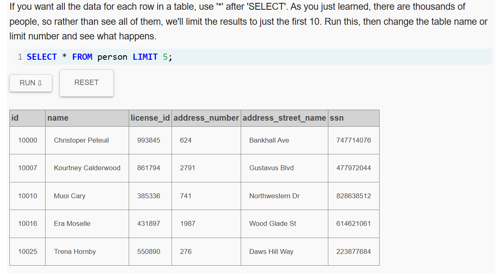

## What is SQL?
SQL, which stands for Structured Query Language, is a way to interact with relational databases and tables.
## What is an ERD?
ERD, which stands for Entity Relationship Diagram, is a visual representation of the relationships among all relevant tables within a database. 
### Primary Key​:
a unique identifier for each row in a table.
### Foreign Key​:
used to reference data in one table to those in another table.
## What is a query? 
Queries are statements we construct to get data from the database.

SQL commands are not case-sensitive, but it's conventional to capitalize them for readability. 
## LIMIT:

## DISTINCT:

## SQL Keywords:
1) SELECT : SELECT​ allows us to grab data for specific columns from the database 
2) FROM : FROM​ allows us to specify which table(s)  
3) WHERE : ​WHERE​ clause in a query is used to filter results by specific criteria. 
 
4) AND | OR : is used to string together multiple filtering criteria so that the filtered results meet each and every one of the criteria. (There's also an OR keyword, which returns rows that match any of the criteria.)

## Wildcards and other functions for partial matches:
Sometimes you only know part of the information you need. SQL can handle that. Special symbols that represent unknown characters are called "wildcards," and SQL supports two. The most common is the % wildcard.

When you place a % wildcard in a query string, the SQL system will return results that match the rest of the string exactly, and have anything (or nothing) where the wildcard is. For example, 'Ca%a' matches Canada and California.

The other, less commonly used wildcard, is _. This one means 'match the rest of the text, as long as there's exactly one character in exactly the position of the _, no matter what it is. So, 'B_b' would match 'Bob' and 'Bub' but not 'Babe' or 'Bb'.

Important: When using wildcards, you don't use the = symbol; instead, you use LIKE.

## BETWEEN AND:
SQL also supports numeric comparisons like < (less than) and > (greater than). You can also use the keywords BETWEEN and AND -- and all of those work with words as well as numbers.

## UPPER() and LOWER():
ex: SELECT DISTINCT city 
FROM crime_scene_report 
WHERE LOWER(city) ='sql city';

## SQL Aggregate Functions:
MAX : 
finds the maximum value 
MIN : 
finds the minimum value 
SUM : 
calculates the sum of the specified column values 
AVG : 
calculates the average of the specified column values 
COUNT​ : 
counts the number of specified column values 
ex: SELECT max(age) FROM drivers_license;

## ORDER BY:
ex : SELECT * FROM drivers_license ORDER BY age ASC LIMIT 10
## JOINS:
INNER, OUTER, LEFT and RIGHT joins are the common table joining operations in SQL
## credits : https://mystery.knightlab.com/walkthrough.html
